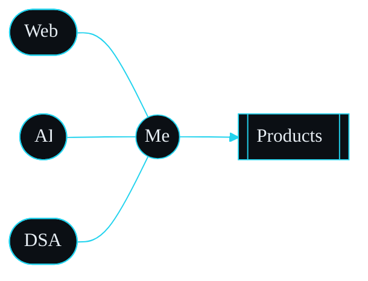
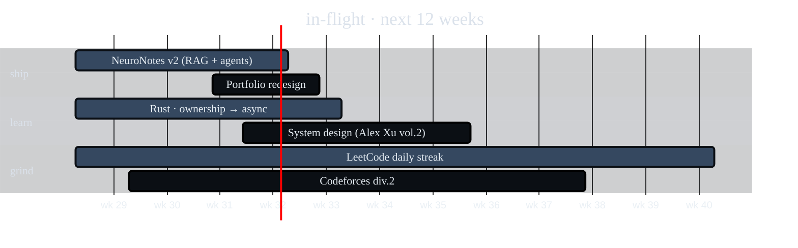

<!--
╭──────────────────────────────────────────────────────────────────╮
│  PRANJAL GUPTA · README  ·  v2 "dossier"                         │
│  Replace <PLACEHOLDER> tokens before pushing.                    │
│    <GH>            github username         <EMAIL>               │
│    <LINKEDIN_URL>  full URL                <PORTFOLIO_URL>       │
│    <TWITTER>       handle w/o @            <LEETCODE>            │
│    <PROJECT_n_REPO> / <PROJECT_n_DEMO>                           │
╰──────────────────────────────────────────────────────────────────╯
-->

<!-- ═══════════ 01 · DOSSIER HEADER ═══════════ -->
<div align="right">
  <sub>
    <code>~/dossier/pranjal.gupta</code> ·
    <a href="<PORTFOLIO_URL>">portfolio</a> ·
    <a href="<LINKEDIN_URL>">linkedin</a> ·
    <a href="mailto:<EMAIL>">mail</a>
  </sub>
</div>

```ansi
╔═══════════════════════════════════════════════════════════════════════════╗
║                                                                           ║
║   P R A N J A L   G U P T A                                               ║
║   ─────────────────────────                                               ║
║   software engineering student · full-stack · ai/ml · competitive coder   ║
║                                                                           ║
║   [ status ]   online · shipping                                          ║
║   [ stack  ]   MERN · Next.js · Python · C++                              ║
║   [ signal ]   building products that feel inevitable                     ║
║                                                                           ║
╚═══════════════════════════════════════════════════════════════════════════╝
```

<!-- ═══════════ 02 · TL;DR STRIP ═══════════ -->

> **TL;DR** — I turn coffee, curiosity and edge-cases into full-stack products.
> Currently obsessed with the seam between *classical software engineering* and *language models*.
> If it can be automated, abstracted, or made 40 ms faster — I want in.

---

<!-- ═══════════ 03 · WHOAMI · two-column ═══════════ -->

### `> whoami --verbose`

<table>
<tr><td width="55%" valign="top">

```toml
[identity]
name       = "Pranjal Gupta"
role       = "SWE Student · Full-Stack · AI Builder"
based_in   = "India"
pronouns   = "he/him"

[currently]
learning   = ["Rust", "Distributed Systems", "LangGraph"]
building   = "AI-native web products (MERN + LLMs)"
grinding   = "LeetCode + system design"
reading    = "Designing Data-Intensive Applications"

[ethos]
motto      = "ship small, ship often, ship quality"
opinion    = "types are documentation that lies less"
weakness   = "over-engineering side projects at 2am"
```

</td><td width="45%" valign="top">

**Currently exploring** &nbsp;·&nbsp; the intersection below



<sub>rendered natively by GitHub · no external images</sub>

</td></tr>
</table>

---

<!-- ═══════════ 04 · TECH STACK · custom pills, not skillicons ═══════════ -->

### `> cat stack.json`

<sub>a curated set — not everything I've touched, just what I actually reach for.</sub>

**Languages**  


**Frontend**  


**Backend & Data**  


**AI / ML**  


**Platform**  


---

<!-- ═══════════ 05 · CURRENT FOCUS · mermaid gantt ═══════════ -->

### `> cat roadmap.q1`



---

<!-- ═══════════ 06 · GITHUB SIGNAL · monochrome tokyonight ═══════════ -->

### `> git log --stat --author=me`

<a href="https://github.com/<GH>">
  &show_icons=true&count_private=true&hide_border=true&hide_title=true&card_width=440&bg_color=0b0f14&title_color=22d3ee&icon_color=f472b6&text_color=e6edf3&ring_color=22d3ee" />
  &hide_border=true&background=0b0f14&stroke=1f2937&ring=22d3ee&fire=f472b6&currStreakLabel=22d3ee&sideLabels=e6edf3&currStreakNum=e6edf3&sideNums=e6edf3&dates=94a3b8" />
</a>

<a href="https://github.com/<GH>">
  &theme=github_dark" width="100%" />
</a>

<a href="https://github.com/<GH>">
  &theme=github_dark" />
  &theme=github_dark&utcOffset=5.5" />
</a>

<!-- activity graph in same palette -->
<a href="https://github.com/<GH>">
  &bg_color=0b0f14&color=22d3ee&line=f472b6&point=ffffff&area=true&area_color=22d3ee&hide_border=true&custom_title=commit%20frequency%20·%20last%2031%20days" width="100%" />
</a>

---

<!-- ═══════════ 07 · PROJECTS · dossier cards inside details ═══════════ -->

### `> ls -lah projects/ | head -5`

<details open>
<summary><b>&nbsp;&nbsp;🧠 &nbsp;<code>neuronotes</code> &nbsp;·&nbsp; AI study companion &nbsp;<sub>next · mongo · rag</sub></b></summary>
<br />
<blockquote>
Turns messy lecture PDFs into flashcards, mind-maps and Socratic quizzes.
Vector search over your own notes; no data leaves the workspace.
<br /><br />
<a href="<PROJECT_1_DEMO>"></a>
<a href="<PROJECT_1_REPO>"></a>
</blockquote>
</details>

<details>
<summary><b>&nbsp;&nbsp;💬 &nbsp;<code>chatverse</code> &nbsp;·&nbsp; realtime chat platform &nbsp;<sub>socket.io · redis · pg</sub></b></summary>
<br />
<blockquote>
Slack-style workspaces with channels, threads and presence over WebSockets.
Redis pub/sub fanout; message search backed by Postgres full-text.
<br /><br />
<a href="<PROJECT_2_DEMO>"></a>
<a href="<PROJECT_2_REPO>"></a>
</blockquote>
</details>

<details>
<summary><b>&nbsp;&nbsp;📈 &nbsp;<code>stackpulse</code> &nbsp;·&nbsp; developer analytics &nbsp;<sub>next · ts · prisma</sub></b></summary>
<br />
<blockquote>
Aggregates GitHub, LeetCode and Codeforces into one dashboard with
contribution heatmaps and streak forecasts.
<br /><br />
<a href="<PROJECT_3_DEMO>"></a>
<a href="<PROJECT_3_REPO>"></a>
</blockquote>
</details>

<details>
<summary><b>&nbsp;&nbsp;🛒 &nbsp;<code>kartify</code> &nbsp;·&nbsp; production e-commerce &nbsp;<sub>mern · stripe</sub></b></summary>
<br />
<blockquote>
End-to-end store — Stripe payments, admin panel, order tracking, JWT auth,
Cloudinary media pipeline.
<br /><br />
<a href="<PROJECT_4_DEMO>"></a>
<a href="<PROJECT_4_REPO>"></a>
</blockquote>
</details>

<br />

<a href="https://github.com/<GH>?tab=repositories">
  
</a>

---

<!-- ═══════════ 08 · CONTRIBUTION SNAKE (kept, retheme) ═══════════ -->

### `> snake --eat contributions`

<picture>
  <source media="(prefers-color-scheme: dark)"
    srcset="https://raw.githubusercontent.com/<GH>/<GH>/output/github-snake-dark.svg" />
  <source media="(prefers-color-scheme: light)"
    srcset="https://raw.githubusercontent.com/<GH>/<GH>/output/github-snake.svg" />
  /<GH>/output/github-snake.svg" />
</picture>

<sub>Powered by <a href="https://github.com/Platane/snk">Platane/snk</a> · add the workflow to <code>&lt;GH&gt;/&lt;GH&gt;/.github/workflows/snake.yml</code></sub>

---

<!-- ═══════════ 09 · CONNECT · terminal prompt ═══════════ -->

### `> connect --with pranjal`

```bash
$ ssh pranjal@lets.build
> topics I love : web-perf · ai-ux · dsa · open-source
> best pings   : mail · linkedin · twitter
> reply time   : usually < 24h ✦ pacific-of-caffeine
```

<p>
  <a href="mailto:<EMAIL>"></a>
  <a href="<LINKEDIN_URL>"></a>
  <a href="https://twitter.com/<TWITTER>"></a>
  <a href="<PORTFOLIO_URL>"></a>
  <a href="https://leetcode.com/<LEETCODE>"></a>
</p>

---

<!-- ═══════════ 10 · FOOTER ═══════════ -->

<sub>
  &label=visitors&color=22d3ee&style=flat-square&labelColor=0b0f14" />
  &nbsp;·&nbsp; open to <b>internships</b>, <b>collaborations</b> and <b>open source</b> &nbsp;·&nbsp;
  <code>EOF ✦ thanks for reading.</code>
</sub>
